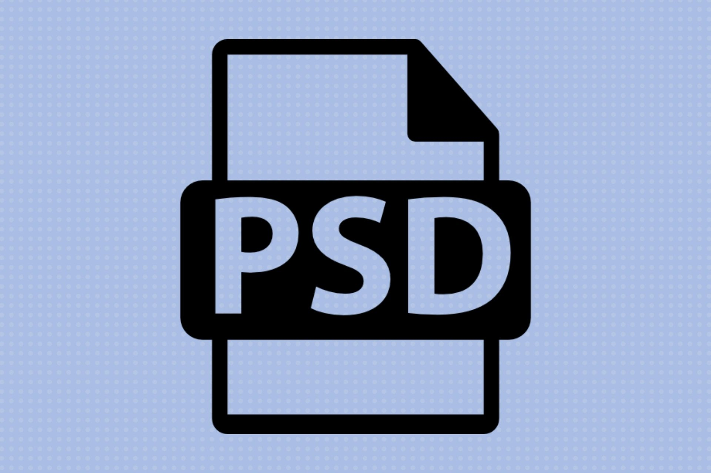

# PSD READER API




> A NodeJs API made with Express.js for parsing and working with PSD files.

### A bit of context

At first, i've created this API to use on a single project made with Fabric.js and HTML Canvas in a specific use case (I need to upload a PSD file and parse it in my Canvas project). But while i'm developing this I see a lot of potential in this project and I decided to share on a individual to expand and add more features to help the community with PSD parsing on whe Web. Feel free to contribute and help this idea to grow in something really good!

### Working...

This project is under development, and the future updates is focusing on the following features.

- [x] Create a first endpoint "/upload" that accepts a PSD file and return a array with all layers in a JSON format

## 💻 Prerequisites

Antes de começar, verifique se você atendeu aos seguintes requisitos:

- Node.js 20.10.0

## 🚀 Installing and using

The project does not yet have a oficial production deployment. But you can start it on your local machine follow this steps:

1. Clone the repository

```
git clone https://github.com/omatheusant/psd-reader.git
```

2. Enter the repo directory

```
cd ./psd-reader/
```

3. Install the projects dependencies

```
npm install
```

4. Run the project!

```
npm run dev
```

If is all right, the message `Server is running at http://localhost:3001` will be displayed in the console.

## 📫 Contributing

To contribute with the PSD Reader API, follow this steps!

1. Fork this repository.
2. Create a branch: `git checkout -b <branch_name>`.
3. Make your changes and confirm it: `git commit -m '<commit_message>'`
4. Send to the original branch: `git push origin psd-reader / <local>`
5. Make a pull request.

You can also check the [Github Documentation of how colaborate with issues and pull requests](https://help.github.com/en/github/collaborating-with-issues-and-pull-requests/creating-a-pull-request)

<!-- ## 🤝 Contributors

I'm thankfull to the all contributors of this project!

<!-- <table>
  <tr>
    <td align="center">
      <a href="#" title="defina o titulo do link">
        <br>
        <sub>
          <b>Iuri Silva</b>
        </sub>
      </a>
    </td>
    <td align="center">
      <a href="#" title="defina o titulo do link">
        <br>
        <sub>
          <b>Mark Zuckerberg</b>
        </sub>
      </a>
    </td>
    <td align="center">
      <a href="#" title="defina o titulo do link">
        <br>
        <sub>
          <b>Steve Jobs</b>
        </sub>
      </a>
    </td>
  </tr>
</table> -->

## 😄 Be one of the contributors!

Want to make part of this project? Feel free to contribute with issues, pull requests or insights and you'll appears on the contributors list

## 📝 License

This project is under license, please read [LICENSE](LICENSE.md) for more details.
